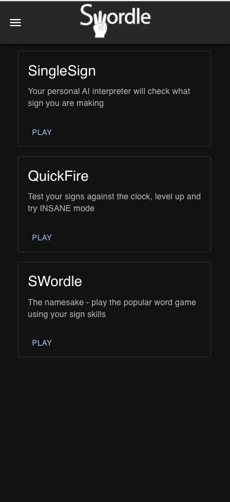
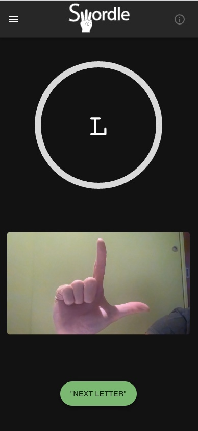
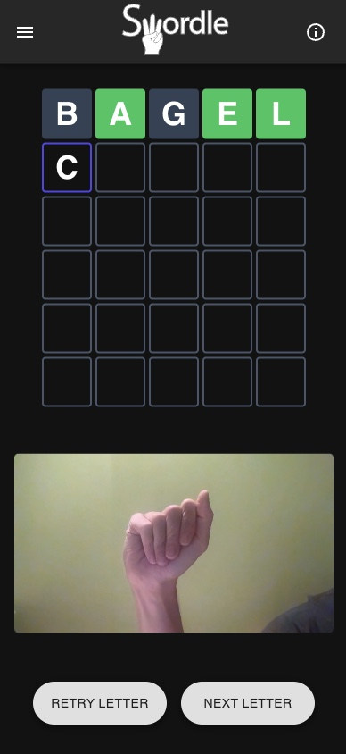

# Swordle UI

This is the UI for SWordle, a set of games which aim to improve knowledge of
sign-language, specifically fingure spelling using American Sign Language (ASL).

The live application can be found at: https://swordle.dev/

  

The UI was built using React, React Webcam, Material UI, Tailwind.

## Games

### SingleSign

Less of a game but more online feedback. You can sign a letter and the online
interpreter (cough... Convolutional Neural Network) will predict which ASL letter
it is.

  

### QuickFire

Test your new found ASL knowledge against the clock. A set of random letter prompts
will be chosen and you have a fixed time to sign them. Try out different levels
to test your progress.

  

### SWordle

Play the popular word game by but without a keyboard! Use your sign to enter your
word guess. Implementation based on [Reactle](https://github.com/cwackerfuss/react-wordle)

  

## Development

This project was bootstrapped with [Create React App](https://github.com/facebook/create-react-app).

## Prerequisites

1. Install node - https://nodejs.org/en/download
2. Install dependences `npm install`

## Available Scripts

In the project directory, you can run:

### `npm start`

Runs the app in the development mode and opens [http://localhost:3000](http://localhost:3000)
to view it in the browser

Requires you to have the apis running locally at [http://localhost:8000](http://localhost:8000)

### `npm run start-rb`

The same as `npm start` but will connect to the remote backend apis

### `npm test`

Launches the test runner in the interactive watch mode.\
See the section about [running tests](https://facebook.github.io/create-react-app/docs/running-tests) for more information.

### `npm run build`

Builds the app for production to the `build` folder.\
It correctly bundles React in production mode and optimizes the build for the best performance.

The build is minified and the filenames include the hashes.\
Your app is ready to be deployed!

See the section about [deployment](https://facebook.github.io/create-react-app/docs/deployment) for more information.

# Credits

- The wordle implementation started from Reactle available from https://github.com/cwackerfuss/react-wordle
